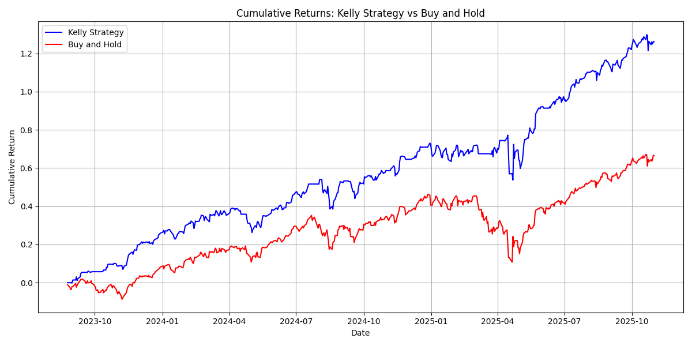

# Simple Nasdaq Trading Using LSTM and Kelly Criterion
This model leverages LSTM and the Kelly Criterion to engage in daily Nasdaq trading. The model achieved significantly better returns than Nasdaq, showcasing its effectiveness and superior performance in trading.
### DISCLAIMER
**This model is purely for research purposes (or to have some fun if you wish so). It should NOT be considered as serious investment advice. Please exercise caution and wisdom when investing your money, making decisions based on thorough research and sound financial principles.**

### Introduction
The model first predicts the likelihood of Nasdaq's upward movement and the extent of such movement by employing an LSTM algorithm trained on Nasdaq data from January 1, 2010, to June 1, 2023. It then utilizes the [Kelly Criterion](https://en.wikipedia.org/wiki/Kelly_criterion) to ascertain the optimal daily trading amounts based on these predictions, maximizing potential gains while managing risks effectively. You can find all the details in the code, it's quite simple honestly. Feel free to explore it to gain a deeper understanding of the logic and mechanisms behind the model's decision-making process.
### Performance
The benchmark below is derived from the outcomes observed from June 2, 2023, to the present day, providing a comparative analysis of the model's performance during this period. The initial balance is set at 1 million dollars; however, the specific amount is not crucial in assessing the model's comparative performance and effectiveness, it's just there for convenience. 
This result will be updated daily, enabling a clear distinction between the model's successes and failures, offering a transparent assessment of its performance over time. 

<table id="csv-table" border="1">
        <!-- Table will be populated here -->
    </table>

    

\
You can download this graph at `result/result.png`. Note that in the graph, the "Buy and Hold" strategy refers to purchasing Nasdaq with the entire initial balance and retaining it over time. This strategy effectively reflects the performance of Nasdaq itself without any active trading or adjustments.
\
You can also download the trade record at `result/record.csv` for a detailed log of all trading activities. The record will be a day ahead of the actual trading day, allowing it to be used as a prediction or reference point for making informed decisions regarding future trading activities. But again, please exercise caution when actually investing with real money. Refer to the [disclaimer](#disclaimer) provided earlier and ensure that you make investment decisions responsibly and with full awareness of the risks involved.

